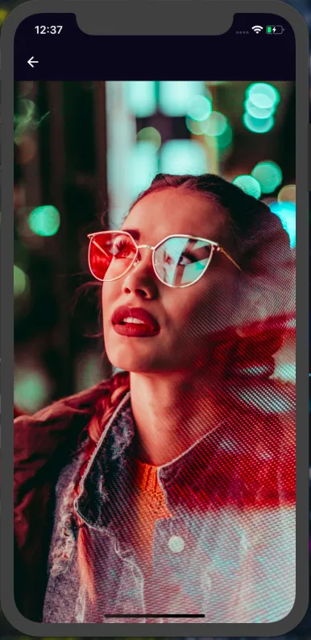
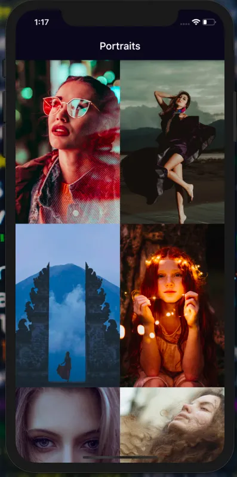

# Portraits

Development of Portraits for which explains flutter and firebase Web Developers Day 3

## Dependencies used

**All dependencies are included in `pubspec.yaml`**

**Dependencies Used in this app**

* **cupertino_icons**
* **firebase_core**
* **firebase_analytics**
* **cloud_firestore**
* **http**

## Screenshots




## To get this layout



## Developed By

```
Parth Aggarwal CEO & Developer of Frazile Inc.
```